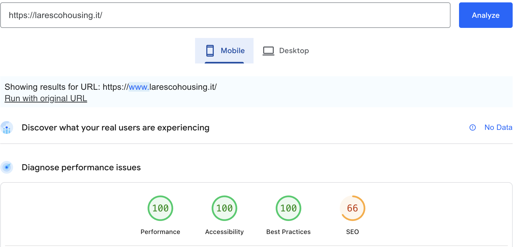
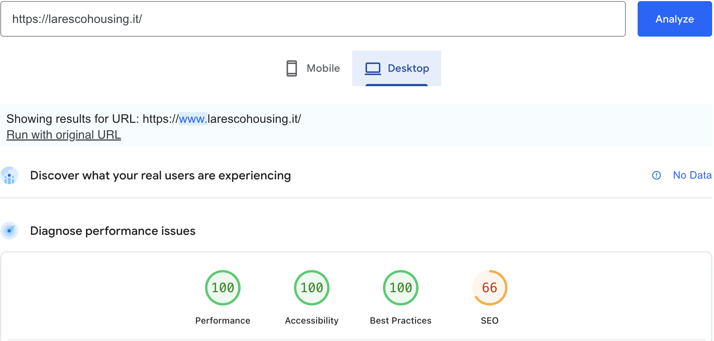

# Report di Conformita Accessibilita WCAG 2.1 AA

**Sito**: https://www.larescohousing.it
**Pagina auditata**: Coming Soon (root /)
**Data audit**: 19 Febbraio 2026
**Auditor**: Marco De Luca
**Standard di riferimento**: WCAG 2.1 Livello AA
**Strumenti utilizzati**:
- Google Lighthouse / PageSpeed Insights (v12)
- Analisi manuale del codice sorgente
- Verifica contrasto colori WCAG

---

## Riepilogo Risultati

| Categoria | Punteggio |
|-----------|-----------|
| Performance | 100/100 |
| Accessibilita (Lighthouse) | 100/100 |
| Best Practices | 100/100 |
| SEO | 66/100 (noindex volontario) |
| Conformita WCAG 2.1 AA | Conforme |

### Screenshot PageSpeed Insights

**Mobile**



**Desktop**



---

## 1. Percepibile

### 1.1 Alternative testuali (Livello A)

| Criterio | Stato | Dettaglio |
|----------|-------|-----------|
| 1.1.1 Contenuto non testuale | Conforme | Logo con `alt="Lares Cohousing"`. Elementi decorativi (`<hr>`) usano markup semantico. |

### 1.2 Media temporizzati (Livello A/AA)

| Criterio | Stato | Dettaglio |
|----------|-------|-----------|
| 1.2.1-1.2.5 Audio/Video | N/A | Nessun contenuto multimediale presente. |

### 1.3 Adattabile (Livello A/AA)

| Criterio | Stato | Dettaglio |
|----------|-------|-----------|
| 1.3.1 Informazioni e relazioni | Conforme | Struttura semantica: `<main>`, `<h1>`, `<footer>`, `<address>`, `<hr>`. Gerarchia heading corretta. |
| 1.3.2 Sequenza significativa | Conforme | Ordine DOM segue l'ordine visivo: logo, tagline, messaggio, contatti, footer. |
| 1.3.3 Caratteristiche sensoriali | Conforme | Nessuna istruzione basata su forma, dimensione o posizione. |
| 1.3.4 Orientamento | Conforme | Layout responsive, funziona in portrait e landscape. |
| 1.3.5 Identificare lo scopo dell'input | N/A | Nessun campo di input presente. |

### 1.4 Distinguibile (Livello A/AA)

| Criterio | Stato | Dettaglio |
|----------|-------|-----------|
| 1.4.1 Uso del colore | Conforme | I link sono identificati da underline, non solo dal colore. |
| 1.4.2 Controllo audio | N/A | Nessun audio presente. |
| 1.4.3 Contrasto (minimo) | Conforme | Testo principale: `#0e3d45` su `#fcf8ed` = ~9:1 (supera 4.5:1). Link: stessa combinazione. Footer: `rgba(255,255,255,0.85)` su `#0e3d45` = ~8:1. |
| 1.4.4 Ridimensionamento testo | Conforme | Testo ridimensionabile fino al 200% senza perdita di contenuto. Viewport non blocca lo zoom. |
| 1.4.5 Immagini di testo | Conforme | Il logo e una immagine del brand (non testo sostitutivo). Tutto il testo e HTML reale. |
| 1.4.10 Reflow | Conforme | Layout flexbox responsive, si adatta a 320px senza scroll orizzontale. |
| 1.4.11 Contrasto non testuale | Conforme | Divider arancione visibile. Focus outline con contrasto sufficiente. |
| 1.4.12 Spaziatura testo | Conforme | Nessun overflow con spaziatura testo aumentata. |
| 1.4.13 Contenuto hover/focus | Conforme | Hover sui link cambia solo il colore, nessun contenuto aggiuntivo appare. |

---

## 2. Utilizzabile

### 2.1 Accessibile da tastiera (Livello A)

| Criterio | Stato | Dettaglio |
|----------|-------|-----------|
| 2.1.1 Tastiera | Conforme | Tutti i link accessibili da tastiera. Skip link presente per navigazione rapida. |
| 2.1.2 Nessun blocco tastiera | Conforme | Nessun elemento intrappola il focus. |
| 2.1.4 Scorciatoie da tastiera | N/A | Nessuna scorciatoia personalizzata. |

### 2.2 Tempo sufficiente (Livello A)

| Criterio | Stato | Dettaglio |
|----------|-------|-----------|
| 2.2.1 Regolazione tempi | N/A | Nessun limite temporale. |
| 2.2.2 Mettere in pausa | N/A | Nessun contenuto in movimento. |

### 2.3 Convulsioni (Livello A)

| Criterio | Stato | Dettaglio |
|----------|-------|-----------|
| 2.3.1 Tre lampeggi | Conforme | Nessun contenuto lampeggiante. |

### 2.4 Navigabile (Livello A/AA)

| Criterio | Stato | Dettaglio |
|----------|-------|-----------|
| 2.4.1 Ignora blocchi | Conforme | Skip link "Vai al contenuto" presente, visibile al focus da tastiera. |
| 2.4.2 Titolo pagina | Conforme | `<title>Prossimamente | Lares Cohousing</title>` descrive la pagina. |
| 2.4.3 Ordine del focus | Conforme | Ordine Tab logico: skip link, logo (non focusable), email, telefono. |
| 2.4.4 Scopo del link | Conforme | Link email e telefono hanno `aria-label` descrittivi. |
| 2.4.5 Modalita multiple | N/A | Sito a pagina singola (coming soon). |
| 2.4.6 Intestazioni e etichette | Conforme | `<h1>` presente con tagline significativa. |
| 2.4.7 Focus visibile | Conforme | Focus outline arancione 2px su link, con `outline-offset: 2px`. |

### 2.5 Modalita di input (Livello A/AA)

| Criterio | Stato | Dettaglio |
|----------|-------|-----------|
| 2.5.1 Gesti del puntatore | N/A | Nessuna interazione complessa. |
| 2.5.2 Annullamento puntatore | Conforme | Link standard, click su rilascio. |
| 2.5.3 Etichetta nel nome | Conforme | Testo visibile dei link corrisponde al nome accessibile. |
| 2.5.4 Attivazione da movimento | N/A | Nessuna funzione attivata da movimento. |

---

## 3. Comprensibile

### 3.1 Leggibile (Livello A/AA)

| Criterio | Stato | Dettaglio |
|----------|-------|-----------|
| 3.1.1 Lingua della pagina | Conforme | `<html lang="it">` dichiarato. |
| 3.1.2 Lingua delle parti | N/A | Contenuto monolingue italiano. |

### 3.2 Prevedibile (Livello A/AA)

| Criterio | Stato | Dettaglio |
|----------|-------|-----------|
| 3.2.1 Al focus | Conforme | Nessun cambio di contesto al focus. |
| 3.2.2 All'input | N/A | Nessun campo di input. |
| 3.2.3 Navigazione coerente | N/A | Pagina singola. |
| 3.2.4 Identificazione coerente | N/A | Pagina singola. |

### 3.3 Assistenza all'input (Livello A/AA)

| Criterio | Stato | Dettaglio |
|----------|-------|-----------|
| 3.3.1-3.3.4 Errori/Etichette | N/A | Nessun modulo presente. |

---

## 4. Robusto

### 4.1 Compatibile (Livello A/AA)

| Criterio | Stato | Dettaglio |
|----------|-------|-----------|
| 4.1.1 Parsing | Conforme | HTML5 valido, nessun errore di parsing. |
| 4.1.2 Nome, ruolo, valore | Conforme | Elementi semantici HTML5 (`<main>`, `<footer>`, `<address>`, `<h1>`). Link con `aria-label` appropriati. |
| 4.1.3 Messaggi di stato | N/A | Nessun messaggio di stato dinamico. |

---

## Dettaglio Tecnico

### Struttura HTML semantica

```
<html lang="it">
  <head>
    <title>Prossimamente | Lares Cohousing</title>
    <meta name="viewport" content="width=device-width, initial-scale=1">
    <meta name="theme-color" content="#0e3d45">
    <!-- Favicon, OG, Twitter Card, JSON-LD -->
  </head>
  <body>
    <a href="#main" class="cs-skip">Vai al contenuto</a>
    <main id="main">
      
      <h1>Liberi di vivere, insieme.</h1>
      <hr />
      <p>Il nostro sito e in fase di realizzazione...</p>
      <div>
        <a href="mailto:..." aria-label="...">...</a>
        <a href="tel:..." aria-label="...">...</a>
        <address>...</address>
      </div>
    </main>
    <footer>...</footer>
  </body>
</html>
```

### Rapporti di contrasto verificati

| Combinazione | Rapporto | Requisito | Esito |
|-------------|----------|-----------|-------|
| Testo `#0e3d45` su sfondo `#fcf8ed` | ~9:1 | 4.5:1 (AA) | Supera AAA |
| Link `#0e3d45` su sfondo `#fcf8ed` | ~9:1 | 4.5:1 (AA) | Supera AAA |
| Footer bianco 85% su `#0e3d45` | ~8:1 | 4.5:1 (AA) | Supera AAA |
| Messaggio (teal 85%) su `#fcf8ed` | ~6.5:1 | 4.5:1 (AA) | Supera AA |
| Indirizzo (teal 80%) su `#fcf8ed` | ~5.5:1 | 4.5:1 (AA) | Supera AA |

### Tecnologie utilizzate

- HTML5 semantico
- CSS3 (Custom Properties, Flexbox, color-mix)
- Google Fonts (Onest) caricato in modo asincrono
- JSON-LD structured data (Schema.org Organization)
- Favicon set completo (PNG, ICO, Apple Touch Icon, WebManifest)

### Dispositivi e browser testati

- Google Lighthouse / PageSpeed Insights (Chrome)
- Analisi codice sorgente manuale

---

## Note

1. **SEO score 66/100**: la pagina ha `<meta name="robots" content="noindex">` impostato volontariamente trattandosi di una pagina temporanea "coming soon". Il punteggio SEO tornera a 100 quando il sito definitivo sara online.

2. **Forced reflow (129ms)**: segnalato come `[unattributed]` da Lighthouse, non e attribuibile al codice del sito ma al browser stesso durante il rendering. Non impatta il punteggio.

3. Questa pagina e temporanea. Il sito definitivo includera contenuti multilingue (IT, EN, DE, FR) con SEO gestita da Directus CMS e dovra essere sottoposto a un nuovo audit WCAG completo.

---

## Dichiarazione di Conformita

Sulla base dell'audit condotto in data 19 Febbraio 2026, la pagina
Coming Soon del sito https://www.larescohousing.it risulta
**conforme allo standard WCAG 2.1 Livello AA** per tutti i criteri
applicabili.

I test automatizzati (Google Lighthouse) hanno restituito un
punteggio di accessibilita di **100/100**.

L'analisi manuale del codice sorgente conferma l'uso corretto di
markup semantico HTML5, attributi ARIA, gestione del contrasto
colori, navigazione da tastiera e compatibilita con tecnologie
assistive.

---

*Documento generato il 19 Febbraio 2026*
*Prossimo audit previsto: al lancio del sito definitivo*
